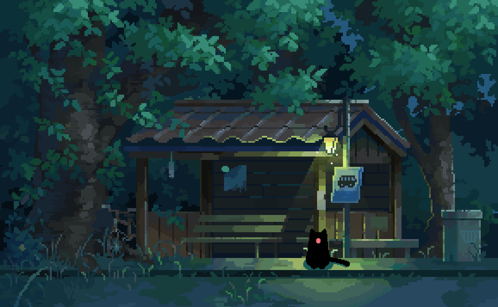

## hey, I'm Amir 👋

Software Engineer in San Francisco 🌁

I like building **fast things**, **cool real-time ml/ai systems**, and occasionally side projects that seem like a good idea at 1 am.

ML & full stack are my domain lately.

My current side project is [trygecko.app](https://trygecko.app/) 🦎🪨  
A climbing tracker that lets you log workouts in seconds while you have chalk on your fingers.

When I'm not coding, I'm probably:

🧗 bouldering v7s  
🏐 playing volleyball  
🎸 jamming electric  
🍜 boosting my beli elo  
🏎️ jailbreaking a 2010-era racing game  

[linkedin](https://www.linkedin.com/in/abaskanov/) · [email](mailto:amirabaskanov@gmail.com?subject=[GitHub]%20Reach%20Out)

